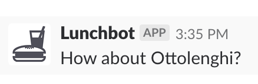

# lunchideas

Slackbot for lunch ideas using Foursquare API

---

<p align="center">
  
</p>

This was built on MLH's Local Hack Day as a fun project to play around with the Foursquare API.

## How to deploy

First push the image:

```sh
$ heroku container:push web -a lunchideas
```

and then run it:

```sh
$ heroku container:release web -a lunchideas
```

## License

MIT
